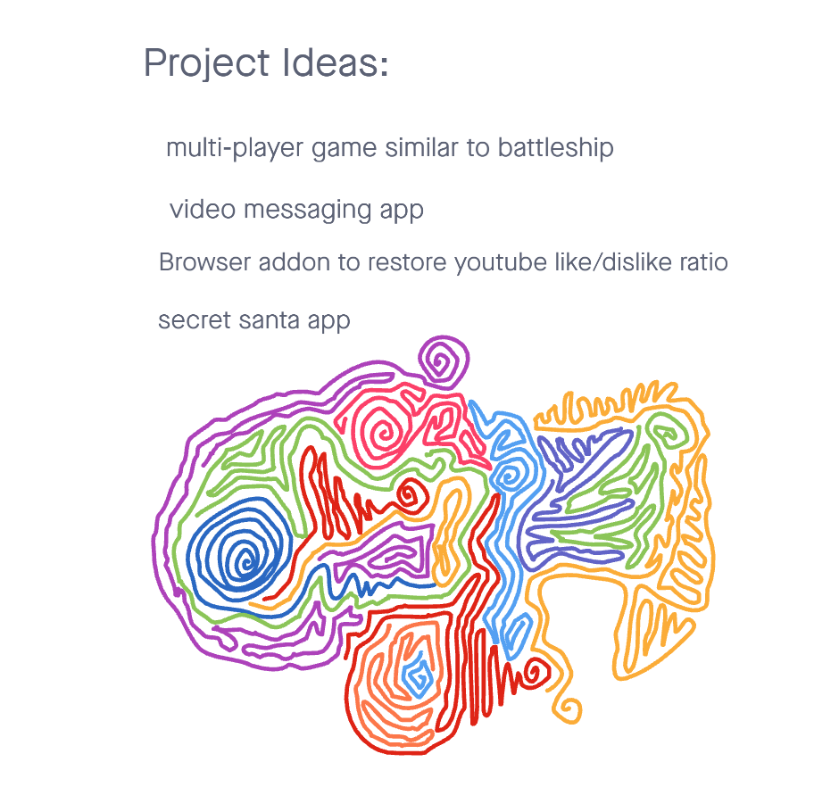

# Project Ideas

## Brainstorming

Grab a whiteboard and brainstorm ideas. During this phase, there is no comment or criticism of ideas. Ideas should be given in the form of titles or very short phrases. If an explanation is needed, save it for the pitch round.

## Sup, Pitches?

Once a critical mass of ideas has been written down, the person who offered the idea will give a pitch. Each pitch may be no longer than 2 to 3 minutes. The purpose of a pitch is to sell the idea to your group mates. During this phase, questions may be asked, but the discussion should be limited. Keep it short and to the point.

At the end of the pitch, you should have formed a short list of favorites.

Once your team had decided on 1 or 2 favorites, prepare your pitches for submission.

Each pitch should contain the following information:

- Name of Project
- Summary of idea.
- What problem or pain point does it solve? a. Keep it high level without going into too much detail. (3-4 sentences is enough)
- Minimum Viable Product (MVP) definition.
  - What is the minimum required for you to present on your demo day?

### Pitch 1

- "Secret Santa"
- Gift exchange generator
- Pain Point: Assists in organizing Secret Santa gift exchanges
  - This takes a user group and randomly assigns each individual a secret partner
  - Individuals can make gift wish lists
  - Users will be able to see the wish list of their secret partner
  - Data will persist
- MVP:
  - Users will have a wishlist
  - Authentication
  - Ability to create users, user groups, user roles, wishlists
  - Ability to update wishlists and user profiles
  - Ability to read own and partner's wishlist
  - Ability to delete own wishlist
  - Ability to assign a secret santa to user / randomizing function

### Pitch 2

- Anonyship
- Multi-player arcade style game
- Pain point: Boredom
  - Command line game
- MVP:
  - Automatically matches two users in the game
  - Each user can fire at the other
  - Each user has a specific amount of lives to lose
  - Users can participate in a chat
